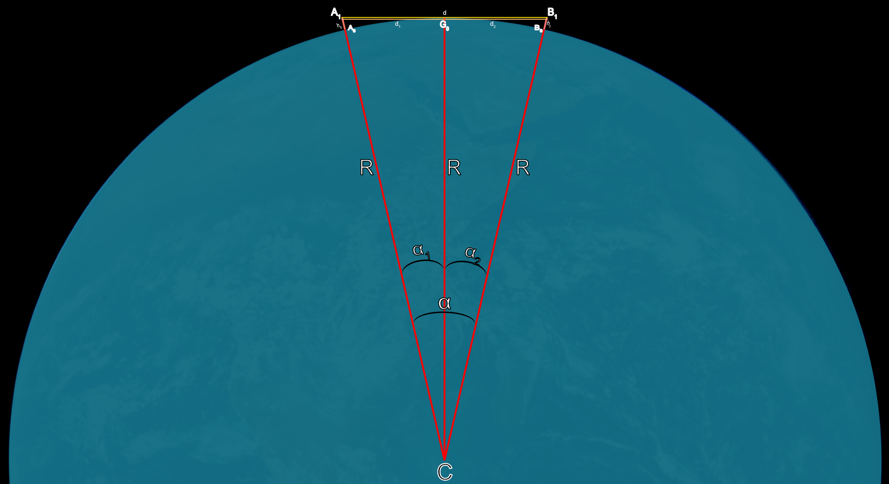

# Sphere curvature calculator
To calculate the geometrical curvature of a "spherical" Earth, there are various methods.

## 1. Pythagoras Theorem
```python
# Pythagoras with two heights, input (d0, h0, R) & output (h1)

from numpy import*

# Data: R, h_0, h_1, d_0, d_1
## R: radius ("Earth radius": 6371 Km)
## h_0: eye height at sea level (in Km)
## d_0: distance in straight line from the observer to the object (in Km)
## h_1: hidden height by curvature (in Km)
## d_1: distance to the geometrical horizon (in Km)
## d_2 = d_0 - d1; d_2: distancia from the geometrical horizon to the object (in Km)
## h_R: height along the distance. Example: if the observer and object are separated at the shore of a lake at 200 m of altitude, the height is the same along all the distance and is not at sea level. (Default h_R = 0, sea level)

# User data
h_R = 0
R = 6371 + h_R
h_0 = 0.001
d_0 = 30

# By Pythagoras: (R+h_0)^2=d_1^2+R^2 and (R+h_1)^2=d_2^2+R^2
d_1 = sqrt(h_0**2+(2*R*h_0))
h_1 = sqrt((d_0-d_1)**2+R**2)-R

print("The distance to the geometrical horizon is %.3f Km and the hidden height is %.3f Km" % (d_1, h_1))
```

[Desmos graph](https://www.desmos.com/calculator/cbdgduxedl)
## 2. Perimeter of a circle
```python
# Angle of curvature of a given perimeter, at sea level.

from numpy import*

# Units in Km
## Input data
R = 6371
C = 2*pi*R # C==12742*pi=40030.14 Km
d = 113 # From observer in Km

# Angle (in degrees) per unit, python defaults to radians
alfa_km = 2*pi/C

# Angle for given distance (d):
alfa = alfa_km*d

# Calculus of the height h:
h = R*(1-cos(alfa))

print("An object at a distance of %.2f km above sea level is hidden %.2f km." % (d, h))
```

## 3. Trigonometry
```python
# Trigonometry at sea level

from numpy import*

# Data: R, h
# Earth radius (R=6371 Km)
R = 6371
# Target hidden height
h = array([1, 2, 3, 4, 5, 6, 7, 8, 9])

# Target distance : d

# By basic trigonometry
d1 = R*arccos(R/(R+h))

# Print the result
for i in range(len(h)):
  print("The hidden height is %d Km for a distance of %.2f Km" % ((i+1, d1[i])
```

# Spheric scheme
- Data:
	- α: angle variation
	- d: distance AB
	- h: observer's hidden DB height
	- R: radius of the spherical Earth (R=6371 Km)
- Points:
	- A0: base of the observer
	- A1: height of observer
	- B0: base of hidden object
	- B1: top of hidden object 
	- C: center of the circle / sphere



Representation of a sphere (R=6371 Km) with distances and heights.
![[Sphere-curve-calc]](Sphere-curve-calc.png)


